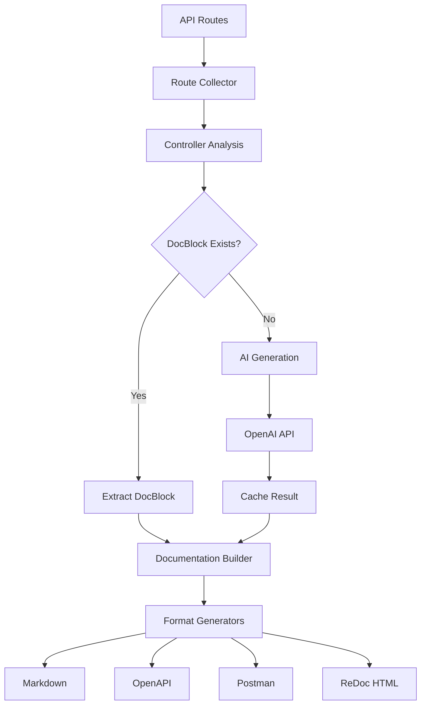

# Laravel API Docx

[](https://packagist.org/packages/digitalcorehub/laravel-api-docx)
[](https://packagist.org/packages/digitalcorehub/laravel-api-docx)
[](https://packagist.org/packages/digitalcorehub/laravel-api-docx)
[](https://packagist.org/packages/digitalcorehub/laravel-api-docx)
[](https://laravel.com)
[](https://github.com/digitalcorehub/laravel-api-docx/actions)

<div align="center">

**Write code. Laravel API Docx writes the docs.**

*AI-powered automatic API documentation generator for Laravel 12*

[Features](#-features) • [Installation](#-installation) • [Usage](#-usage) • [Examples](#-examples) • [Configuration](#-configuration) • [Contributing](#-contributing)

</div>

---

## 🚀 Features

### 🤖 **AI-Powered Intelligence**
- **Smart Documentation**: Automatically generates meaningful descriptions using OpenAI GPT-4
- **Advanced Analysis**: Creates request/response examples, parameter documentation, and error responses
- **Context-Aware**: Understands Laravel patterns and generates relevant documentation
- **Intelligent Caching**: Avoids redundant AI API calls with smart caching

### 📝 **Multiple Output Formats**
- **Markdown**: Human-readable documentation perfect for GitHub/GitLab
- **OpenAPI 3.0**: Industry-standard specification for Swagger UI integration
- **Postman Collection**: Ready-to-import API testing collections
- **ReDoc HTML**: Beautiful, interactive documentation pages

### 🔍 **Smart Route Analysis**
- **Automatic Discovery**: Scans all API routes (starting with `api/`)
- **Controller Analysis**: Extracts controller and method information
- **DocBlock Integration**: Uses existing docblocks when available
- **Middleware Detection**: Analyzes route middleware and requirements

### ⚡ **Developer Experience**
- **Zero Configuration**: Works out of the box with sensible defaults
- **Watch Mode**: Automatically regenerates documentation on file changes
- **Progress Indicators**: Beautiful CLI output with emojis and progress bars
- **Error Handling**: Comprehensive error reporting and recovery

### 🎯 **Laravel 12 Ready**
- **Modern PHP**: Built for PHP 8.3+ with latest language features
- **Laravel 12**: Fully compatible with the latest Laravel version
- **Performance**: Optimized for speed and memory efficiency
- **Security**: Follows Laravel security best practices

---

## 📦 Installation

### Via Composer

```bash
composer require digitalcorehub/laravel-api-docx
```

The package will automatically register itself with Laravel.

### Publish Configuration

```bash
php artisan vendor:publish --provider="DigitalCoreHub\LaravelApiDocx\LaravelApiDocxServiceProvider" --tag="api-docs-config"
```

### Environment Setup

Add your OpenAI API key to your `.env` file:

```env
OPENAI_API_KEY=your-openai-api-key-here
OPENAI_API_ENDPOINT=https://api.openai.com/v1/chat/completions
```

---

## 🎯 Usage

### Quick Start

Generate documentation for all your API routes:

```bash
php artisan api:docs
```

This creates:
- 📝 `docs/api.md` - Markdown documentation
- 🔗 `docs/api.json` - OpenAPI 3.0 specification  
- 📮 `docs/api.postman.json` - Postman collection
- 🌐 `docs/api.html` - Interactive ReDoc page

### Advanced Usage

#### Format Selection

```bash
# Generate specific formats
php artisan api:docs --format=markdown
php artisan api:docs --format=openapi
php artisan api:docs --format=postman
php artisan api:docs --format=redoc

# Generate all formats (default)
php artisan api:docs --format=all
```

#### AI-Enhanced Documentation

```bash
# Generate with advanced AI features
php artisan api:docs --advanced

# Features include:
# - Request/response examples
# - Parameter documentation
# - Error response mapping
# - Smart tagging and grouping
```

#### Watch Mode

```bash
# Automatically regenerate on file changes
php artisan api:docs --watch

# Combine with advanced AI
php artisan api:docs --advanced --watch
```

#### Custom Output Paths

```bash
# Custom output directory
php artisan api:docs --output=/custom/docs/

# Custom file for specific format
php artisan api:docs --format=markdown --output=/path/to/api.md
```

---

## 🔧 How It Works



### Process Flow

1. **🔍 Route Discovery**: Scans all registered routes and filters API routes
2. **📊 Controller Analysis**: Extracts controller, method, and middleware information
3. **📚 DocBlock Processing**: Checks for existing documentation in controller methods
4. **🤖 AI Enhancement**: Generates descriptions, examples, and parameters using OpenAI
5. **💾 Smart Caching**: Stores AI results to avoid redundant API calls
6. **📝 Documentation Generation**: Creates comprehensive docs in multiple formats

---

## 📋 Examples

### Markdown Output

```markdown
# API Documentation

Generated automatically by **digitalcorehub/laravel-api-docx**.

## GET|POST /api/users

- **Controller:** `App\Http\Controllers\UserController@index`
- **Name:** `users.index`
- **Middleware:** `auth,throttle:60,1`

Retrieves a paginated list of users with optional filtering and sorting capabilities.

### Parameters
- `page` (query): Page number for pagination
- `per_page` (query): Number of items per page (max 100)
- `search` (query): Search term for filtering users

### Example Request
```json
GET /api/users?page=1&per_page=20&search=john
```

### Example Response
```json
{
  "data": [
    {
      "id": 1,
      "name": "John Doe",
      "email": "john@example.com",
      "created_at": "2024-01-01T00:00:00Z"
    }
  ],
  "meta": {
    "current_page": 1,
    "per_page": 20,
    "total": 100
  }
}
```

## GET /api/users/{user}

- **Controller:** `App\Http\Controllers\UserController@show`
- **Name:** `users.show`
- **Middleware:** `auth`

Displays detailed information about a specific user including profile data and settings.

### Parameters
- `user` (path): User ID or username

### Example Response
```json
{
  "id": 1,
  "name": "John Doe",
  "email": "john@example.com",
  "profile": {
    "avatar": "https://example.com/avatar.jpg",
    "bio": "Software Developer"
  },
  "created_at": "2024-01-01T00:00:00Z",
  "updated_at": "2024-01-01T00:00:00Z"
}
```
```

### OpenAPI 3.0 Output

```json
{
  "openapi": "3.0.0",
  "info": {
    "title": "API Documentation",
    "description": "Generated automatically by digitalcorehub/laravel-api-docx",
    "version": "1.0.0",
    "contact": {
      "name": "API Support",
      "email": "support@example.com"
    }
  },
  "servers": [
    {
      "url": "https://api.example.com",
      "description": "Production Server"
    },
    {
      "url": "http://localhost:8000",
      "description": "Development Server"
    }
  ],
  "paths": {
    "/users": {
      "get": {
        "summary": "List users",
        "description": "Retrieves a paginated list of users with optional filtering and sorting capabilities.",
        "tags": ["Users"],
        "parameters": [
          {
            "name": "page",
            "in": "query",
            "description": "Page number for pagination",
            "required": false,
            "schema": {
              "type": "integer",
              "minimum": 1,
              "default": 1
            }
          },
          {
            "name": "per_page",
            "in": "query",
            "description": "Number of items per page",
            "required": false,
            "schema": {
              "type": "integer",
              "minimum": 1,
              "maximum": 100,
              "default": 20
            }
          }
        ],
        "responses": {
          "200": {
            "description": "Successful response",
            "content": {
              "application/json": {
                "schema": {
                  "type": "object",
                  "properties": {
                    "data": {
                      "type": "array",
                      "items": {
                        "$ref": "#/components/schemas/User"
                      }
                    },
                    "meta": {
                      "$ref": "#/components/schemas/PaginationMeta"
                    }
                  }
                }
              }
            }
          }
        }
      }
    }
  },
  "components": {
    "schemas": {
      "User": {
        "type": "object",
        "properties": {
          "id": {
            "type": "integer",
            "example": 1
          },
          "name": {
            "type": "string",
            "example": "John Doe"
          },
          "email": {
            "type": "string",
            "format": "email",
            "example": "john@example.com"
          },
          "created_at": {
            "type": "string",
            "format": "date-time"
          }
        }
      }
    }
  }
}
```

### Postman Collection

```json
{
  "info": {
    "name": "API Documentation",
    "description": "Generated automatically by digitalcorehub/laravel-api-docx",
    "schema": "https://schema.getpostman.com/json/collection/v2.1.0/collection.json",
    "version": "1.0.0"
  },
  "item": [
    {
      "name": "Users",
      "description": "User management endpoints",
      "item": [
        {
          "name": "List Users",
          "request": {
            "method": "GET",
            "header": [
              {
                "key": "Accept",
                "value": "application/json",
                "type": "text"
              }
            ],
            "url": {
              "raw": "{{base_url}}/api/users?page=1&per_page=20",
              "host": ["{{base_url}}"],
              "path": ["api", "users"],
              "query": [
                {
                  "key": "page",
                  "value": "1",
                  "description": "Page number"
                },
                {
                  "key": "per_page",
                  "value": "20",
                  "description": "Items per page"
                }
              ]
            },
            "description": "Retrieves a paginated list of users with optional filtering and sorting capabilities."
          }
        }
      ]
    }
  ],
  "variable": [
    {
      "key": "base_url",
      "value": "http://localhost:8000",
      "type": "string"
    }
  ]
}
```

---

## ⚙️ Configuration

### AI Settings

```php
// config/api-docs.php
'ai' => [
    'provider' => 'openai',
    'model' => 'gpt-4o-mini', // or 'gpt-4', 'gpt-3.5-turbo'
    'api_key' => env('OPENAI_API_KEY'),
    'endpoint' => env('OPENAI_API_ENDPOINT', 'https://api.openai.com/v1/chat/completions'),
    'timeout' => 15,
    'max_tokens' => 500,
],
```

### Output Paths

```php
'output' => base_path('docs/api.md'),
'openapi_output' => base_path('docs/api.json'),
'postman_output' => base_path('docs/api.postman.json'),
'redoc_output' => base_path('docs/api.html'),
```

### Caching

```php
'cache' => [
    'enabled' => true,
    'store_path' => storage_path('app/laravel-api-docx-cache.php'),
    'ttl' => 3600, // 1 hour
],
```

### Advanced Options

```php
'advanced' => [
    'generate_examples' => true,
    'include_middleware' => true,
    'include_validation_rules' => true,
    'group_by_controller' => true,
    'sort_routes' => 'uri', // 'uri', 'method', 'name'
],
```

---

## 🧪 Testing

### Run Tests

```bash
# Run all tests
composer test

# Run with coverage
composer test-coverage

# Run specific test suite
./vendor/bin/phpunit --testsuite=Unit
./vendor/bin/phpunit --testsuite=Feature
```

### Code Quality

```bash
# Check code style
composer check-style

# Fix code style issues
composer fix-style

# Run static analysis
composer analyse

# Security audit
composer audit
```

---

## 🚀 Performance

### Optimization Tips

1. **Enable Caching**: Always enable caching in production
2. **Use Watch Mode**: For development, use `--watch` to avoid manual regeneration
3. **Selective Generation**: Use `--format` to generate only needed formats
4. **AI Optimization**: Use `gpt-4o-mini` for faster AI responses

### Benchmarks

| Operation | Time | Memory |
|-----------|------|--------|
| Route Collection | ~50ms | ~2MB |
| DocBlock Parsing | ~100ms | ~1MB |
| AI Generation (10 routes) | ~2s | ~5MB |
| Markdown Generation | ~20ms | ~1MB |
| OpenAPI Generation | ~30ms | ~2MB |

---

## 🤝 Contributing

We welcome contributions! Please see our [Contributing Guide](CONTRIBUTING.md) for details.

### Development Setup

```bash
# Clone the repository
git clone https://github.com/digitalcorehub/laravel-api-docx.git
cd laravel-api-docx

# Install dependencies
composer install

# Run tests
composer test

# Check code style
composer check-style
```

### Pull Request Process

1. Fork the repository
2. Create your feature branch (`git checkout -b feature/amazing-feature`)
3. Commit your changes (`git commit -m 'Add amazing feature'`)
4. Push to the branch (`git push origin feature/amazing-feature`)
5. Open a Pull Request

---

## 📊 Roadmap

### Upcoming Features

- [ ] **GraphQL Support**: Generate documentation for GraphQL APIs
- [ ] **Custom Themes**: Multiple ReDoc themes and customization options
- [ ] **API Versioning**: Support for multiple API versions
- [ ] **Export Options**: PDF, Word, and other format exports
- [ ] **Team Collaboration**: Multi-user documentation editing
- [ ] **API Testing**: Built-in API testing capabilities
- [ ] **Webhook Integration**: Automatic documentation updates via webhooks

### Version History

- **v1.0.0** - Initial release with basic features
- **v1.1.0** - Added Postman and ReDoc support
- **v1.2.0** - Advanced AI features and watch mode
- **v1.3.0** - Performance optimizations and caching improvements

---

## 🛡️ Security

### Security Policy

We take security seriously. If you discover a security vulnerability, please:

1. **DO NOT** create a public GitHub issue
2. Email us at security@digitalcorehub.com
3. Include detailed information about the vulnerability
4. We'll respond within 24 hours

### Security Features

- **Input Validation**: All inputs are validated and sanitized
- **API Key Protection**: OpenAI API keys are never logged or exposed
- **File Permissions**: Generated files have appropriate permissions
- **Dependency Scanning**: Regular security audits of dependencies

---

## 📞 Support

### Getting Help

- 📖 **Documentation**: Check this README and [Wiki](https://github.com/digitalcorehub/laravel-api-docx/wiki)
- 🐛 **Bug Reports**: [GitHub Issues](https://github.com/digitalcorehub/laravel-api-docx/issues)
- 💬 **Discussions**: [GitHub Discussions](https://github.com/digitalcorehub/laravel-api-docx/discussions)
- 📧 **Email**: info@digitalcorehub.com

### Community

- 🌟 **Star us** on GitHub if you find this project helpful
- 🐦 **Follow us** on Twitter [@DigitalCoreHub](https://twitter.com/DigitalCoreHub)
- 💼 **LinkedIn**: [Digital Core Hub](https://linkedin.com/company/digital-core-hub)

---

## 📄 License

This project is licensed under the MIT License - see the [LICENSE](LICENSE) file for details.

---

## 🙏 Acknowledgments

- **Laravel Team** for the amazing framework
- **OpenAI** for the powerful AI capabilities
- **ReDoc** for the beautiful documentation UI
- **Postman** for the API testing platform
- **All Contributors** who help make this project better

---

<div align="center">

**Made with ❤️ by [Digital Core Hub](https://digitalcorehub.com)**

[Website](https://digitalcorehub.com) • [GitHub](https://github.com/digitalcorehub) • [Twitter](https://twitter.com/DigitalCoreHub) • [LinkedIn](https://linkedin.com/company/digital-core-hub)

*If this project helps you, please give it a ⭐ on GitHub!*

</div>